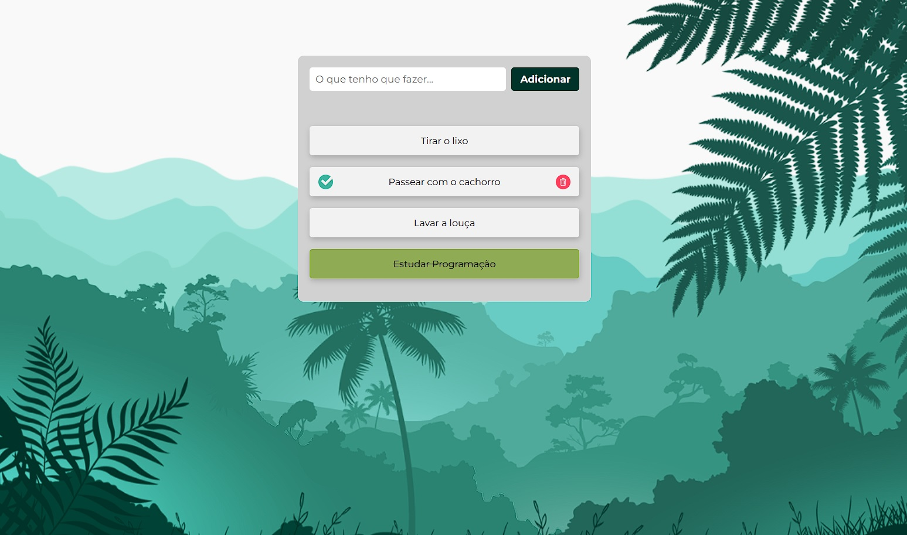

# ✅ Lista de Tarefas

Uma aplicação web simples de lista de tarefas (To-Do List), desenvolvida com HTML, CSS e JavaScript. Permite adicionar, remover e riscar tarefas concluídas de forma prática.

## Preview



## Funcionalidades

- Adicionar novas tarefas
- Marcar tarefas como concluídas
- Remover tarefas da lista
- Layout leve e responsivo

## Tecnologias usadas

- HTML5
- CSS3
- JavaScript

## Aprendizados

Durante o desenvolvimento deste projeto, foram praticados conceitos como:

- Manipulação do DOM com JavaScript puro
- Eventos de clique e input
- Atualização dinâmica do conteúdo da página
- Organização de layout com CSS responsivo
- Boas práticas de estruturação de código

## Como rodar

1. Clone o repositório:
   ```bash
   git clone https://github.com/lucasdoeni/Lista-de-Tarefas.git
